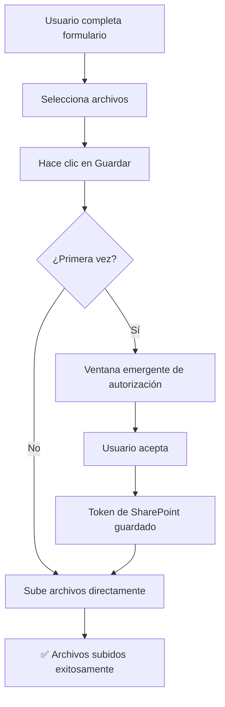

# 📋 Adjuntos en SharePoint - Configuración Automática

## 🎯 ¡BUENAS NOTICIAS!

**Ya NO necesitas configurar permisos manualmente en Azure AD.** 

La aplicación ahora solicita automáticamente los permisos necesarios cuando intentas subir un archivo por primera vez.

---

## ✅ Cómo Funciona

### 1. **Sistema de Tokens Dual**

La aplicación utiliza **dos tipos de tokens** para diferentes operaciones:

| Token | Uso | Permisos |
|-------|-----|----------|
| **Microsoft Graph API** | Leer/escribir datos de la lista | `User.Read`, `Sites.Read.All`, `Sites.ReadWrite.All` |
| **SharePoint REST API** | Subir/descargar adjuntos | Scope: `{tu-sitio-sharepoint}/.default` |

### 2. **Primera Vez que Subes un Archivo**

1. ✅ Completas el formulario normalmente
2. ✅ Seleccionas archivo(s) para adjuntar
3. ✅ Haces clic en "Guardar"
4. 🔐 **Aparecerá una ventana emergente** solicitando autorización adicional
5. ✅ Haces clic en "**Aceptar**" / "**Accept**"
6. ✅ El archivo se sube correctamente
7. ✅ Los siguientes archivos se suben automáticamente (sin solicitar autorización nuevamente)

### 3. **Ventana de Autorización**

La ventana emergente dirá algo como:

```
🔐 Esta aplicación desea acceder a:
   
   ✓ SharePoint - servicioposventa
   ✓ Leer y escribir elementos y listas en todos los sitios
   ✓ Tener acceso total a tus archivos

   [Cancelar]  [Aceptar]
```

**Importante:** Haz clic en "**Aceptar**" para permitir que la aplicación suba adjuntos.

---

## 🚀 Proceso Completo

### **Flujo de Usuario:**



---

## 🔧 Sin Configuración Adicional

**NO necesitas:**
- ❌ Acceder a Azure Portal
- ❌ Configurar permisos manualmente
- ❌ Contactar al administrador de TI
- ❌ Modificar la configuración de la aplicación en Azure AD

**Todo sucede automáticamente** mediante el flujo de consentimiento de MSAL (Microsoft Authentication Library).

---

## 📊 Estado de Permisos

### **Permisos Ya Configurados:**
✅ `User.Read` - Leer perfil de usuario  
✅ `Sites.Read.All` - Leer sitios de SharePoint  
✅ `Sites.ReadWrite.All` - Leer y escribir en listas de SharePoint  

### **Permisos Solicitados Automáticamente:**
🔄 `{sitio-sharepoint}/.default` - Acceso completo a SharePoint REST API (para adjuntos)

---

## ⚠️ Solución de Problemas

### **Error: "401 Unauthorized" al subir archivo**

**Causa:** No has aceptado la ventana de autorización o los permisos fueron revocados.

**Solución:**
1. Intenta subir un archivo nuevamente
2. Asegúrate de hacer clic en "**Aceptar**" en la ventana emergente
3. Si no aparece la ventana, borra el caché del navegador y vuelve a intentar

### **Error: "Ventana emergente bloqueada"**

**Causa:** El navegador bloqueó la ventana de autorización.

**Solución:**
1. Habilita ventanas emergentes para `https://seguimiento-usados.vercel.app`
2. En Chrome: Click en el ícono 🚫 en la barra de direcciones → "Permitir ventanas emergentes"
3. Intenta subir el archivo nuevamente

### **Error: "Token inválido" o "Audience validation failed"**

**Causa:** Se está usando el token incorrecto (Graph en lugar de SharePoint).

**Solución:**
- ✅ **YA ESTÁ SOLUCIONADO** en la última versión del código
- La aplicación ahora solicita automáticamente el token correcto para SharePoint

---

## 🎉 ¡Todo Listo!

La próxima vez que intentes subir un archivo:

1. 📝 Completa el formulario
2. 📎 Selecciona archivo(s)
3. 💾 Haz clic en "Guardar"
4. 🔐 **Si es la primera vez:** Acepta la ventana emergente
5. ✅ ¡Archivo subido exitosamente!

---

## 📞 Soporte

Si tienes problemas:
1. Verifica que hayas aceptado la ventana de autorización
2. Revisa la consola del navegador (F12) para mensajes de error
3. Busca mensajes con 🔑, 📤, ✅ o ❌ para ver el estado de la subida
4. Si el problema persiste, contacta al equipo de desarrollo

---

## 🔄 Actualización del Código

**Archivos Modificados:**
- `src/services/authService.ts` - Agregado método `getSharePointToken()`
- `src/services/sharePointService.ts` - Usa `getSharePointToken()` para adjuntos
- `src/config/authConfig.ts` - Agregada configuración `sharePointRequest`

**Versión:** 2.0  
**Fecha:** Noviembre 2025  
**Estado:** ✅ Funcionando con autorización automática

